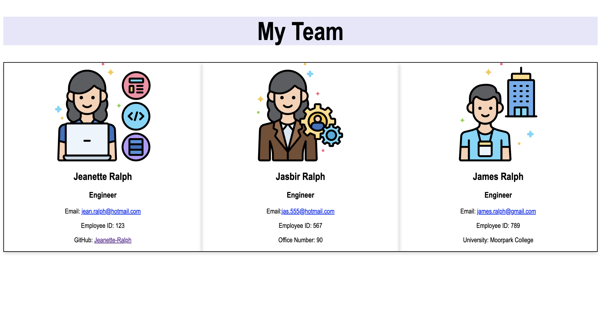

 # Team Profile Generator 

## 📝 Table of Contents
* [License Utilized](#license-utilized)
* [Project Details](#project-details)
* [Usage Information](#usage-information)
* [Installation Instructions](#installation-instructions)
* [Contribution Guidelines](#contribution-guidelines)
* [Testing Guidelines](#testing-guidelines)
* [Any Questions ?](#any-questions)

## 🔑 License Utilized
MIT 

## 🚀 Project Details
Utilizing Javascript and Node.js I developed an application that prompts the user to enter information regarding team members they wish to create. This information is then added to a clean and concisely formatted html file.This Team Profile generator will help users organize people on their team. [App Demo](https://drive.google.com/file/d/1ngAW6xM4Rx82JLgh2Cd4kujWvHF6G6CW/view)

## 👩‍💻 Usage Information
This application is used to create an html page for all your team members by entering input in the command line. This application is used by running node index.js in the command line. 

## 💻 Installation Instructions
In order to run this application the user needs to install the npm package.

## 🤝 Contribution Guidelines
As of now there are no plans for other developers to contribute to this repository.

## 💡 Testing Guidelines
Developers can run the command “node index.js” and "npx jest" in the command line to test this application. 

## 🙋‍♀️ Any Questions?

If you have any further questions please reach out.

Email: jeanette.k.ralph@gmail.com 

GitHub link: [https://github.com/Jeanette-Ralph](https://github.com/Jeanette-Ralph)

GitHub username: Jeanette-Ralph
